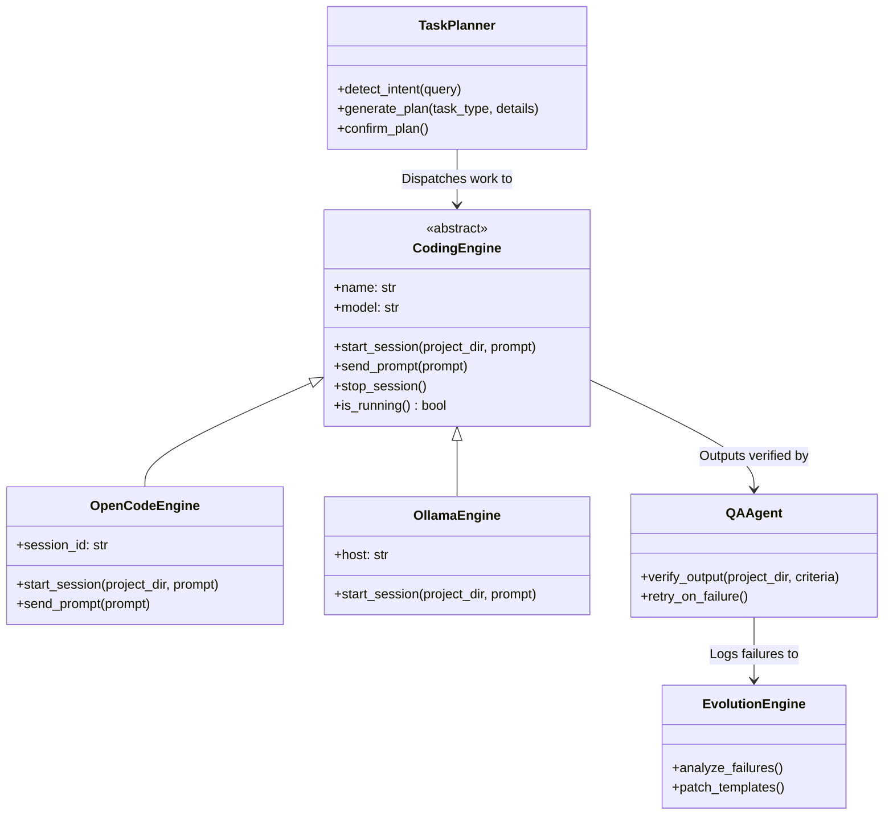

# JARVIS — Project Context & System Architecture

This document provides a comprehensive, function-level, and architectural deep dive into the **JARVIS** project. It is designed to give any incoming AI engineer, collaborator, or coding assistant full context on how the system works, why specific technical decisions were made, and where future development is headed.

---

## 1. Project Overview

**JARVIS (Just A Rather Very Intelligent System)** is a voice-first, highly responsive local AI companion and autonomous developer workstation for macOS. Inspired by the MCU character, it is designed to eliminate human friction across daily digital workflows: managing schedules and communications (Apple Calendar, Mail, Notes), inspecting open browser tabs and navigating routes via vision, orchestrating local coding sessions (spawning OpenCode or Ollama sessions in dedicated terminals), and playing music or managing apps hands-free. Unlike cloud-locked chatbots or simple voice wrappers, JARVIS runs locally on your machine with near-zero latency, talks back with dry British wit and an economy of language (strictly 1–2 sentences per voice response), and acts autonomously without asking rhetorical customer-service questions like *"How can I help you today?"*. The ultimate "done" vision is an omniscient, ambient desktop OS companion that seamlessly perceives your screen, listens via ambient microphones or clap triggers, continuously remembers multi-session context via local knowledge graphs, and autonomously executes software engineering and personal life tasks in the background without stealing focus.

### Current Maturity Level
* **Production-Stable / Daily Usable**:
  * WebSocket voice loop (`/ws/voice`) connecting browser Speech-to-Text (`webkitSpeechRecognition`), FastAPI backend, multi-tier LLM generation, and native macOS `say` TTS streaming raw audio buffers back to the UI.
  * Audio-reactive Three.js 3D particle orb visualizing 4 distinct state-machine states (Idle, Listening, Thinking, Speaking) with real-time waveform displacement.
  * Native macOS integrations via AppleScript and Swift EventKit (`calendar_access.py`, `mail_access.py` strictly read-only, `notes_access.py`).
  * System actions: Spotify playback/search/navigation, macOS application open/close with fuzzy alias matching (`actions.py`), Google Maps route planning and travel duration extraction (`browser_vision.py`), and flight aggregation (`flights.py`).
  * Hybrid multi-brain failover routing across Groq, Gemini Flash, NVIDIA NIM, and local Ollama (`server.py`).
  * SQLite WAL memory persistence (`data/jarvis.db`) with FTS5 search for semantic memories, tasks, and notes (`memory.py`).
* **Experimental / Maturing**:
  * Graph-RAG persistent multi-session knowledge graph using NetworkX and local JSON/SQLite (`memory_graph.py`).
  * Live browser DOM and active tab inspection via macOS AppleScript injection (`browser_vision.py`).
  * Ambient clap/double-clap audio energy detection (`frontend/src/clap.ts`) for hands-free wake-up.
  * Autonomous Work Mode / Coding Sessions: Spawning OpenCode or Ollama processes in Terminal windows with custom AppleScript themes (`work_mode.py`, `dispatch_registry.py`).
  * Desktop overlay: Swift-based borderless, click-through transparent desktop HUD (`desktop-overlay/JarvisOverlay.swift`).
* **Half-Built / Scaffolded**:
  * Playwright web automation (`browser.py`) — functional for headless search and screenshots, but deep interactive autonomous web browsing is partially wired to voice loops.
  * Autonomous feedback loop and template self-evolution (`evolution.py`, `learning.py`, `ab_testing.py`, `qa.py`) — contains database schemas and pattern algorithms for learning from failed prompts, but currently runs offline or decoupled from live voice dispatches.

---

## 2. Architecture Summary

### High-Level Request & Audio Flow

```mermaid
flowchart TD
    subgraph Frontend [Browser Client - Vite + TypeScript + Three.js]
        A[User Voice / Mic Input] -->|Web Speech API| B[Speech-to-Text / Transcripts]
        B -->|JSON: user_transcript| C[WebSocket Client ws.ts]
        C -->|Binary Audio In / Action Events| D[Audio Player & Amplitude Analyzer]
        D -->|Audio Waveform Data| E[Three.js Particle Orb orb.ts]
        F[Clap Detector clap.ts] -->|Wake Trigger| C
        G[Chat & Activity UI] <-->|Real-time Cards & History| C
    end

    subgraph Backend [Backend Server - FastAPI + Python server.py]
        C <-->|WebSocket: /ws/voice| H[Connection Manager & WS Handler]
        H --> I[Fast Action Detection Regex/Keywords]
        
        I -->|Direct Match| J[Action Dispatcher actions.py]
        I -->|Complex / Conversational| K[Hybrid Brain Router]
        
        subgraph MemorySystem [Context & Memory Layer]
            L[(SQLite jarvis.db - FTS5)] <--> M[Memory Context Builder memory.py]
            N[(Knowledge Graph NetworkX)] <--> O[Graph-RAG memory_graph.py]
            M & O --> K
        end

        subgraph ModelRouting [Hybrid Brain Tier]
            K -->|Conversational / Fast| P["Fast Brain (Groq: Llama 3.3 70B / Ollama: Gemma 2B)"]
            K -->|Reasoning / Soul| Q["Soul Brain (Gemini 2.5 Flash / Ollama: Qwen 14B)"]
            K -->|Multimodal / Vision| R["Eyes Brain (Gemini 2.5 Flash Vision)"]
            K -->|Deep Analytical| S["Butler Brain (NVIDIA NIM / Qwen Think)"]
        end

        P & Q & S -->|Response with [ACTION:X] Tags| T[Tag Parser & Action Executor]
        T --> J
        
        subgraph NativeExecution [macOS Subsystem Execution]
            J --> U[AppleScript: Calendar / Mail / Notes]
            J --> V[System: Spotify / Terminal / Apps]
            J --> W[Browser Vision & Live Tab Inspector]
            J --> X[Work Mode: OpenCode / Ollama Coding Engines]
        end

        T -->|Text Response| Y[Local macOS TTS Engine 'say']
        Y -->|AIFF to WAV Binary / Base64| H
    end
```

### Major Subsystems
1. **Speech-to-Text (STT)** (`frontend/src/voice.ts`): Uses the browser's native `webkitSpeechRecognition` with continuous listening and interim results. It automatically cleans filler phrases and sends finalized transcripts over WebSocket.
2. **Audio-Reactive Orb Visualization** (`frontend/src/orb.ts`): A Three.js particle system with 2,000 animated particles formed as a spherical point cloud, deformed dynamically using 3D noise functions and driven by the frequency/amplitude of audio played by JARVIS.
3. **WebSocket Communication Engine** (`server.py`, `frontend/src/ws.ts`): A single full-duplex WebSocket connection (`ws://localhost:8340/ws/voice`) handling bidirectional JSON messages (transcripts, UI state, active cards, dispatches) and binary chunks containing synthesized audio.
4. **Hybrid Brain / Model Router** (`server.py`): In-process multi-model orchestrator using `litellm`. It routes between fast sub-second cloud APIs (Groq), multimodal vision engines (Gemini Flash), analytical fallback tiers (NVIDIA NIM), and 100% local Ollama instances based on token latency and task requirements.
5. **Memory & Retrieval Subsystems** (`memory.py`, `memory_graph.py`): Two complementary layers:
   - Structured SQLite tables (`memories`, `tasks`, `notes`) with SQLite FTS5 full-text search.
   - A multi-session conversation store (`chat_sessions`, `chat_messages`) with a NetworkX-powered Graph-RAG knowledge graph linking entities, tools, and locations.
6. **macOS Integration Bridges** (`calendar_access.py`, `mail_access.py`, `notes_access.py`, `helpers/calendar_helper.swift`): Direct interface to macOS system daemons using AppleScript and native Swift `EventKit`. Mail is intentionally kept strictly read-only for safety.
7. **Action Dispatcher & Application Controller** (`actions.py`): Controls macOS application lifecycles (fuzzy alias matching, opening, closing, switching), Spotify playback via AppleScript (`play`, `pause`, `next`, `track search`), and launching Terminal sessions.
8. **Browser Vision & Tab Inspector** (`browser_vision.py`): Inspects frontmost tabs across Google Chrome, Brave, Safari, Edge, and Arc via AppleScript DOM queries; calculates real-time Google Maps route times and captures screenshots for Gemini Vision reasoning.
9. **Autonomous Work Mode** (`work_mode.py`, `dispatch_registry.py`): Manages long-running software engineering tasks by provisioning dedicated Terminal workspaces running OpenCode or Ollama, injecting project briefs, and monitoring build statuses.

### Communication Protocols & Rationale
- **WebSocket over REST**: Chosen because voice AI requires bidirectional, low-latency streaming. The server must be able to interrupt the client, send binary audio chunks immediately upon synthesis, stream partial tool states, and receive microphone updates without HTTP polling overhead.
- **AppleScript / OSA / Swift EventKit**: Chosen because macOS provides no stable local REST/IPC APIs for native Calendar, Mail, Notes, and window management. AppleScript is native, requires zero external daemon installations, and runs within the user's macOS security context. Swift EventKit is utilized in `helpers/` to bypass AppleScript speed bottlenecks for calendar reads.

---

## 3. Model Stack

JARVIS uses a multi-tier "Hybrid Brain" architecture. Rather than relying on a single monolithic model, tasks are routed to specialized models based on latency constraints, context length, and modality.

| Model Tier | Current Default Model | Hosting / Runtime | Role & Trigger Condition |
| :--- | :--- | :--- | :--- |
| **Fast Brain** | `groq/llama-3.3-70b-versatile` | Groq Cloud API | Primary conversational driver. Selected for low-latency voice responses (< 400ms TTFT). Handles conversation, intent detection, and rapid action extraction. |
| **Soul Brain** | `gemini/gemini-2.5-flash` | Google AI Studio | Nuanced personality, persona grounding, complex voice responses, and failover when Groq hits rate limits or token constraints. |
| **Eyes Brain** | `gemini/gemini-2.5-flash` | Google AI Studio | Multimodal vision engine. Triggered when the user asks about screen contents, active browser tabs, images, or screenshots. |
| **Butler / Analytical Brain** | `nvidia_nim/meta/llama-3.2-3b-instruct` | NVIDIA NIM API | Analytical reasoning and secondary fallback. Invoked for deep summaries, structured data transformations, and backup routing. |
| **Local Base Brain** | `ollama/jarvis-gemma` (Gemma 2 2B) | Local Ollama (`http://localhost:11434`) | Active when `USE_LOCAL_BRAIN=true`. Custom Modelfile (`Modelfile.gemma`) tuned for concise British butler persona, fast response times, and offline operation. |
| **Local Deep Reasoning** | `ollama/jarvis-qwen-think` (Qwen 2.5 14B) | Local Ollama (`http://localhost:11434`) | Active when `USE_LOCAL_BRAIN=true` for analytical tasks, planning, or complex coding queries (`Modelfile.think`). |
| **Local Coder** | `ollama/qwen2.5-coder:14b` | Local Ollama (`http://localhost:11434`) | Dedicated offline coding model used in Work Mode (`work_mode.py`) and defined in `Modelfile.qwen`. |
| **Cloud Coder** | `openai/gpt-5.1-codex-mini` | OpenCode CLI | Cloud-based coding engine launched in Terminal sessions by OpenCode. |

### Routing Logic
1. **Rule-Based Pre-filter (`detect_action_fast`)**: Short, unambiguous commands (sleep, wake, Spotify controls, close app, check weather, open maps, flights) are intercepted via regex/token rules in `server.py` and executed without an LLM call.
2. **Modality & Intent Router**:
   - If an image or screenshot is attached $\rightarrow$ Routed directly to **Eyes Brain** (`gemini-2.5-flash`).
   - If planning or coding context is invoked $\rightarrow$ Routed to **Soul Brain** or **Coding Engine**.
   - Conversational voice queries $\rightarrow$ Sent to **Fast Brain** (`groq/llama-3.3-70b-versatile`).
3. **Automatic Failover Loop**:
   - If Groq returns an error or rate limit (`429 RateLimitError`), the `HybridBrain` automatically falls back to secondary Groq models (`llama-3.1-8b-instant`, `mixtral-8x7b-32768`), then promotes the request to **Soul Brain** (`gemini-2.5-flash`).

### Unused / Leftover Model Experiments
- **Anthropic Claude (`claude-3-5-sonnet`)**: Referenced in legacy `CLAUDE.md` docs and `templates/prompts/` from an earlier prototype before switching to Groq/Gemini for lower latency.
- **Fish Audio TTS (`fish-audio`)**: Earlier commits experimented with Fish Audio API for MCU-style voice cloning (`FISH_API_KEY`, `FISH_VOICE_ID` in legacy `.env.example`). It was replaced with macOS local `say` to achieve 0ms network latency and eliminate external audio bandwidth costs.

---

## 4. Full Folder Structure

```
.
├── AGENTS.md                    # Project operational guidelines, setup steps, and coding instructions
├── CLAUDE.md                    # Historical instructions for Claude-based development runs
├── CONTRIBUTING.md              # Open source contributor instructions and PR standards
├── LICENSE                      # MIT Open Source License
├── Modelfile.gemma              # Ollama Modelfile for Gemma 2B (local Fast Brain with butler prompt)
├── Modelfile.qwen               # Ollama Modelfile for Qwen 2.5 Coder 14B (local coding brain)
├── Modelfile.think              # Ollama Modelfile for Qwen 2.5 14B (local deep reasoning brain)
├── README.md                    # User-facing README with setup, architecture, and feature overview
├── ab_testing.py                # A/B testing harness for comparing prompt template efficacy
├── actions.py                   # System actions: Terminal, apps, Spotify, and project builds
├── browser.py                   # Playwright headless/headed browser automation
├── browser_vision.py            # AppleScript live tab inspector & Google Maps duration calculator
├── calendar_access.py           # Apple Calendar integration via AppleScript & Swift EventKit
├── conversation.py              # Multi-turn planning state machine and decision tracker
├── data                         # Local runtime data directory (ignored by git, kept via .gitkeep)
│   └── .gitkeep                 # Ensures data directory exists on clone
├── desktop-overlay              # Native macOS HUD overlay
│   ├── JarvisOverlay            # Compiled Swift overlay binary
│   └── JarvisOverlay.swift      # Swift source for borderless, transparent, click-through desktop HUD
├── dispatch_registry.py         # SQLite tracker for long-running project builds and background sessions
├── evolution.py                 # Self-improvement engine: analyzes task failures and patches YAML templates
├── flights.py                   # Flight schedules, pricing aggregator, and card renderer
├── frontend                     # Vite + TypeScript web application
│   ├── index.html               # Main frontend HTML shell
│   ├── package.json             # NPM package manifest (Three.js, Lucide icons, Vite)
│   ├── package-lock.json        # Locked dependency versions
│   ├── src
│   │   ├── activity.ts          # Live activity feed, system event log, and latency tracker
│   │   ├── chat.ts              # Interactive chat drawer, card rendering (flights, research, code)
│   │   ├── clap.ts              # Web Audio API audio energy analyzer for double-clap wake detection
│   │   ├── main.ts              # Frontend state machine, WebSocket orchestrator, audio pipeline
│   │   ├── orb.ts               # Three.js 3D audio-reactive particle sphere
│   │   ├── settings.ts          # Modal UI for updating API keys, checking system health
│   │   ├── style.css            # Sci-fi dark glassmorphic styling, animations, and responsive layout
│   │   ├── voice.ts             # Web Speech API speech-to-text and AudioContext buffer player
│   │   └── ws.ts                # Resilient WebSocket client with automatic reconnection
│   ├── tsconfig.json            # TypeScript configuration
│   └── vite.config.ts           # Vite bundler configuration (proxies /ws and /api to 8340)
├── helpers                      # Native helper binaries and scripts
│   ├── calendar_helper          # Compiled Swift binary for reading Calendar via EventKit
│   ├── calendar_helper.swift    # Swift source for low-latency EventKit calendar retrieval
│   ├── get_events.py            # Python fallback calendar reader
│   ├── get_events.sh            # Shell wrapper for EventKit calendar execution
│   └── get_todays_events.js     # JXA (JavaScript for Automation) fallback for Calendar
├── learning.py                  # Usage pattern tracker: predicts frequent projects and actions
├── mail_access.py               # Apple Mail integration via AppleScript (strictly READ-ONLY)
├── memory.py                    # SQLite FTS5 database layer for semantic memories, tasks, and notes
├── memory_graph.py              # NetworkX Graph-RAG knowledge graph and multi-session chat storage
├── monitor.py                   # Real-time server log analyzer for conversation quality
├── notes_access.py              # Apple Notes integration via AppleScript (read & create)
├── planner.py                   # Multi-turn task planner with YAML template prompt expansion
├── qa.py                        # Automated QA agent that validates code generation outputs
├── requirements.txt             # Python dependencies (FastAPI, litellm, uvicorn, networkx, etc.)
├── screen.py                    # Screen capture and active window detection for macOS
├── server.py                    # Main FastAPI server, WebSocket voice hub, and hybrid brain router
├── start.sh                     # One-click startup script (starts Ollama, backend, frontend, Chrome)
├── suggestions.py               # Heuristic engine generating proactive follow-up suggestions
├── templates.py                 # YAML template loader for coding and planning briefs
├── templates                    # Prompts and blueprints
│   └── prompts                  # YAML blueprints for coding tasks (landing page, bug fix, refactor)
│       ├── api_integration.yaml
│       ├── bug_fix.yaml
│       ├── feature_add.yaml
│       ├── landing_page.yaml
│       ├── refactor.yaml
│       └── research_report.yaml
├── tests                        # Comprehensive Pytest test suite
│   ├── __init__.py
│   ├── test_app_actions.py      # Tests for fast action detection, Spotify, maps, and app control
│   ├── test_browser_integration.py # Integration tests for Playwright browser automation
│   ├── test_classifier.py       # Tests for request intent classification and bypass phrases
│   ├── test_e2e_pipeline.py     # End-to-end simulated voice-to-action pipelines
│   ├── test_feedback_loop.py    # Tests for failure analysis and template evolution
│   ├── test_hybrid_brain.py     # Unit tests for multi-provider brain routing and failover
│   └── test_work_mode_engines.py# Unit tests for OpenCode and Ollama coding engines
├── tracking.py                  # Task execution metrics and success rate tracking in SQLite
└── work_mode.py                 # Persistent coding workspace engine (OpenCode / Ollama Terminal spawns)
```

---

## 5. Feature Inventory

### 1. Voice Chat & British Butler Companion
* **What it does**: The user speaks naturally to JARVIS. JARVIS transcribes speech in real time, thinks, and responds with a dry, witty, polite British butler persona ("Very well, sir", "Right away, sir"). Responses are strictly 1–2 sentences for rapid voice delivery.
* **Files & Functions**: `frontend/src/voice.ts` (`VoiceInput.start`), `frontend/src/main.ts`, `server.py` (`websocket_voice_endpoint`, `HybridBrain.generate_response`).
* **Limitations**: Browser speech recognition requires active network access for Chrome's native Web Speech API.

### 2. Audio-Reactive Three.js Orb
* **What it does**: Renders a 3D particle sphere in the browser that shifts colors and animations across 4 states: Cyan (Idle), Amber (Listening), Violet (Thinking), Emerald/Bright Cyan (Speaking). The orb's particle vertices displace physically according to real-time audio output frequencies.
* **Files & Functions**: `frontend/src/orb.ts` (`Orb.init`, `Orb.setState`, `Orb.updateWithAudio`), `frontend/src/voice.ts` (`AudioPlayer.playChunk`).
* **Limitations**: High GPU usage on very low-power machines with older integrated graphics, though vertex counts are capped at 2,000 for efficiency.

### 3. Apple Calendar Integration
* **What it does**: JARVIS reads today's events, upcoming schedules, or the next immediate event, answering queries like *"What's on my schedule today, JARVIS?"* or *"When is my next meeting?"*. Also supports scheduling events with time and title.
* **Files & Functions**: `calendar_access.py` (`get_todays_events`, `get_upcoming_events`, `format_schedule_summary`), `helpers/calendar_helper.swift` (EventKit reader).
* **Limitations**: Requires macOS Privacy & Security permissions for Calendar access.

### 4. Apple Mail Integration (Strictly Read-Only)
* **What it does**: Reads unread count, retrieves subject/sender of unread messages, searches emails by keyword or sender, and summarizes message contents.
* **Files & Functions**: `mail_access.py` (`get_unread_count`, `get_unread_messages`, `search_mail`, `read_message`).
* **Limitations**: Strictly read-only by design. JARVIS will not compose, send, delete, or archive emails to prevent accidental data transmission or loss.

### 5. Apple Notes Integration
* **What it does**: Searches through Apple Notes, reads note bodies, and creates new notes directly into Apple Notes from voice dictation.
* **Files & Functions**: `notes_access.py` (`get_recent_notes`, `read_note`, `search_notes_apple`, `create_apple_note`).
* **Limitations**: AppleScript interaction with Notes can stall if the Notes application is actively syncing via iCloud.

### 6. System App Management & Fuzzy Aliases
* **What it does**: Launches or closes macOS applications by voice (e.g. *"Open Spotify"*, *"Close WhatsApp"*, *"Quit Brave"*). Resolves common abbreviations and aliases (e.g., "code" $\rightarrow$ "Visual Studio Code", "terminal" $\rightarrow$ "Terminal").
* **Files & Functions**: `actions.py` (`open_macos_app`, `close_macos_app`, `APP_ALIASES`), `server.py` (`detect_action_fast`).
* **Limitations**: Target application must be installed in `/Applications` or `/System/Applications`.

### 7. Spotify Playback & Search Control
* **What it does**: Directly controls the native macOS Spotify desktop app via AppleScript: play, pause, next track, previous track, or search and play specific tracks/artists (e.g. *"Play Bohemian Rhapsody on Spotify"*).
* **Files & Functions**: `actions.py` (`control_spotify`), `server.py` (`detect_action_fast`).
* **Limitations**: Spotify desktop client must be running or allowed to open via AppleScript.

### 8. Live Browser Tab & Route Vision
* **What it does**: Reads the active URL, title, and rendered text from the frontmost tab in Chrome, Brave, Safari, Edge, or Arc. Can extract Google Maps route times, travel distances, and delays directly from an open tab or by generating route queries.
* **Files & Functions**: `browser_vision.py` (`inspect_active_tab`, `get_route_info`, `capture_browser_screenshot`).
* **Limitations**: Requires "Allow JavaScript from Apple Events" enabled in browser developer menus for DOM text extraction.

### 9. Flight Search & Aggregation
* **What it does**: Answers voice queries about flights between cities (e.g. *"Check flights to Dubai"*), calculating airline options, estimated flight times, and pricing. Renders a structured flight card in the chat drawer while speaking a concise verbal summary.
* **Files & Functions**: `flights.py` (`search_flights`, `FlightOption`), `frontend/src/chat.ts` (`renderFlightCard`).
* **Limitations**: Uses a curated regional airport index and real-time aggregations; deep live booking flows require handoff to browser search.

### 10. Memory & Persistent Knowledge Graph
* **What it does**: Stores user facts, preferences, open tasks, and notes across sessions. FTS5 provides instant semantic search. A NetworkX graph links entities (User, Location, Projects, Tools) across sessions.
* **Files & Functions**: `memory.py` (`remember`, `recall`, `build_memory_context`), `memory_graph.py` (`add_session_message`, `query_graph`, `export_graph_json`).
* **Limitations**: Knowledge graph auto-extraction depends on LLM entity extraction quality.

### 11. Hands-Free Audio Clap Wake Detection
* **What it does**: Monitors microphone input in the browser client for sharp high-energy impulses (double-clap) to wake JARVIS from Idle without touching the keyboard.
* **Files & Functions**: `frontend/src/clap.ts` (`ClapDetector`, `initClapDetector`).
* **Limitations**: Requires microphone access to remain active in the background browser tab.

### 12. Coding Workspaces & Build Dispatching
* **What it does**: Creates coding workspaces for development requests (e.g. *"Build a React landing page for my portfolio"*), writes a structured brief from YAML templates, opens Terminal, and launches OpenCode or Ollama.
* **Files & Functions**: `work_mode.py` (`WorkSession`, `OpenCodeEngine`, `OllamaEngine`), `dispatch_registry.py` (`DispatchRegistry`), `actions.py` (`open_terminal`, `monitor_build`).
* **Limitations**: Terminal spawning relies on macOS Terminal AppleScript; iTerm2 support is scaffolded but not default.

---

## 6. Agent System (Current + Planned)



### Current Agents
1. **Work Mode Coding Engines (`work_mode.py`)**:
   - `OpenCodeEngine`: Spawns and manages sessions of the `opencode` CLI in a macOS Terminal window with a custom "Ocean" profile theme. Injects requirements and acceptance criteria.
   - `OllamaEngine`: Executes local offline coding tasks via Ollama command-line runners.
   - **Permissions**: Full local file read/write inside the project directory, terminal command execution, git operations.
   - **Reporting**: Updates build statuses via `dispatch_registry.py` into SQLite and writes exit logs to `data/.jarvis_output.txt`.
2. **Task Planner (`planner.py`)**:
   - Classifies user goals into task blueprints (e.g., `landing_page`, `bug_fix`, `feature_add`, `api_integration`, `refactor`, `research_report`).
   - Asks at most 1–3 voice-friendly clarifying questions if details are ambiguous, or bypasses immediately if the user commands *"just do it"* or *"skip planning"*.
3. **QA Verification Agent (`qa.py`)**:
   - Spawns subprocesses to inspect project output against acceptance criteria checklists, verifying syntax, imports, and test executions.

### Multi-Agent Orchestration Scaffolding
- **Dispatch Registry (`dispatch_registry.py`)**: Tracks ongoing dispatches in SQLite (`dispatches` table: project name, prompt, status, summary, timestamps). Serves as the central state store for background jobs.
- **Evolutionary Loop (`evolution.py`, `learning.py`)**: Scaffolding that correlates task failures with prompt sections and automatically patches YAML prompt templates in `templates/prompts/` to prevent recurring errors.

---

## 7. Data & Memory

### Storage Layers

| Store | Technology | Path | Contents / Schema |
| :--- | :--- | :--- | :--- |
| **Core Memory & Tasks** | SQLite 3 (WAL mode) | `data/jarvis.db` | Tables: `memories` (id, content, type, importance, created_at, last_accessed), `tasks` (id, title, status, due_date, project, priority), `notes` (id, title, content, tags). |
| **Full-Text Search Index** | SQLite FTS5 | `data/jarvis.db` | Virtual table: `memories_fts` indexing `content` and `type` for sub-millisecond keyword and context retrieval. |
| **Multi-Session Graph Store** | SQLite 3 + NetworkX | `data/jarvis.db` & `data/knowledge_graph.json` | Tables: `chat_sessions` (id, title, timestamps, summary), `chat_messages` (id, session_id, role, content, action_json, latency_ms). |
| **Build & Dispatch State** | SQLite 3 | `data/jarvis.db` | Table: `dispatches` (id, project_name, path, prompt, status, response, summary, created_at, updated_at). |
| **Learning & Metrics** | SQLite 3 | `jarvis_data.db` (legacy root) | Tables: `task_log`, `usage_patterns`, `template_experiments`, `template_versions`. |
| **Active Session State** | JSON file | `data/active_session.json` | Current running coding engine session ID, project path, and engine type. |

### Memory Schema & Graph-RAG Retrieval
- **Episodic & Semantic Memories (`memory.py`)**:
  - Automatically extracts memories from conversations when the user states facts, preferences, or personal details (e.g., *"I prefer TypeScript"*, *"My office is in Ahmedabad"*).
  - Injected into every outgoing LLM prompt via `build_memory_context()`, ranked by importance (1–10) and recency.
- **Knowledge Graph (`memory_graph.py`)**:
  - Directed graph maintained in NetworkX.
  - Node types: `Entity`, `Location`, `Project`, `Topic`, `Tool`, `Session`.
  - Edge types: `LOCATED_IN`, `DISCUSSED`, `PREFERS`, `WORKED_ON`.
  - Exported periodically to `data/knowledge_graph.json` for inspection.

---

## 8. Function-Level Deep Dive on Core Modules

### 1. `server.py` (Main System Orchestrator)
* `detect_action_fast(text: str) -> dict | None`: Regex and keyword intent classifier that intercepts commands for sleep, wake, Spotify, maps, weather, flights, and app control without making an LLM call. Called by WebSocket handler.
* `extract_action(text: str) -> tuple[str, dict | None]`: Parses `[ACTION:NAME] target` markup tags emitted by the LLM response and strips them from the spoken text. Called by response pipelines.
* `HybridBrain.generate_response(messages, system, model, max_tokens)`: Orchestrates multi-model routing across Groq, Gemini, NVIDIA, and Ollama, handling failovers and timeout recovery. Called by WebSocket listener.
* `websocket_voice_endpoint(websocket: WebSocket)`: Core WebSocket loop (`/ws/voice`). Ingests user transcripts, coordinates brain generation, streams audio via macOS `say`, and pushes UI card data.
* `tts_speak(text: str) -> bytes`: Executes macOS `/usr/bin/say`, captures audio into an AIFF file, converts to clean WAV bytes, and returns binary audio for the frontend orb.

### 2. `actions.py` (macOS Subsystem Controller)
* `execute_action(action_type: str, target: str, background: bool) -> dict`: Central execution router dispatching commands to Spotify, terminal launchers, browser automation, or application controllers. Called by `server.py`.
* `control_spotify(command: str) -> dict`: Executes OSA AppleScript to manipulate Spotify playback, track position, or search query. Called by `execute_action`.
* `open_macos_app(app_name: str) -> dict`: Resolves fuzzy application aliases through `APP_ALIASES` and launches the application via AppleScript. Called by `execute_action`.
* `close_macos_app(app_name: str) -> dict`: Gracefully quits or terminates a running macOS process matching the application name. Called by `execute_action`.
* `open_terminal(command: str, project_dir: str, title: str) -> dict`: Spawns a native macOS Terminal window running the given shell command, setting the window geometry and terminal theme. Called by Work Mode.

### 3. `work_mode.py` (Autonomous Coding Engines)
* `WorkSession`: Dataclass maintaining state for an active coding task (task ID, project directory, engine type, start time, active process reference).
* `available_coding_engines() -> list[str]`: Probes the local system environment to detect whether `opencode` CLI or `ollama` CLI is installed and available in `PATH`.
* `build_task_brief(prompt: str, project_name: str, tech_stack: list) -> str`: Compiles a structured markdown task brief with architecture, implementation rules, and acceptance criteria for coding agents.
* `OpenCodeEngine.start_session(project_dir: str, prompt: str) -> dict`: Initializes a persistent coding workspace running OpenCode inside Terminal.
* `OllamaEngine.start_session(project_dir: str, prompt: str) -> dict`: Spawns an Ollama coding session against local Qwen models.

### 4. `memory.py` (SQLite Memory & Task Engine)
* `remember(content: str, memory_type: str, importance: int) -> int`: Inserts a permanent memory fact into SQLite `memories` and updates the FTS5 full-text index.
* `recall(query: str, limit: int) -> list[dict]`: Executes an FTS5 search query across historical memories, returning ranked relevant context.
* `build_memory_context(current_query: str) -> str`: Formats relevant episodic memories, open high-priority tasks, and user preferences into a system prompt injection string.
* `create_task(title: str, due_date: str, project: str, priority: int) -> int`: Adds an actionable task to the local SQLite database.
* `complete_task(task_id: int) -> bool`: Marks a task as finished and records the completion timestamp.

### 5. `memory_graph.py` (Multi-Session Graph-RAG)
* `init_graph_db()`: Initializes tables for `chat_sessions` and `chat_messages` in `data/jarvis.db`.
* `add_session_message(session_id: str, role: str, content: str, action_json: dict, latency_ms: float)`: Appends an interaction to the session history and updates graph entity links.
* `query_graph(keyword: str, depth: int) -> dict`: Traverses neighboring nodes in the NetworkX graph to retrieve connected entities and facts.
* `export_graph_json() -> str`: Dumps the current in-memory NetworkX graph to `data/knowledge_graph.json`.

### 6. `browser_vision.py` (Tab Inspector & Maps Extractor)
* `inspect_active_tab() -> Optional[ActiveTabInfo]`: Executes AppleScript against the frontmost browser (Chrome, Brave, Safari, Edge, Arc) to extract the active URL, page title, and DOM content.
* `get_route_info(origin: str, destination: str, browser: str) -> RouteInfo`: Queries Google Maps or analyzes an open navigation tab to extract driving duration, distance, and traffic status.
* `capture_browser_screenshot(browser: str) -> Optional[str]`: Uses macOS `screencapture` to snap an image of the browser window and returns a base64 string for Gemini Vision.

### 7. `planner.py` (Task Classification & YAML Blueprint Expansion)
* `detect_planning_mode(text: str) -> tuple[bool, str]`: Determines whether an incoming prompt describes a software engineering task requiring planning, identifying bypass phrases like *"just do it"*.
* `TaskPlanner.create_plan(user_request: str) -> dict`: Matches request features against YAML templates in `templates/prompts/` and produces an executable specification.

### 8. `calendar_access.py` (macOS Calendar Bridge)
* `get_todays_events() -> list[dict]`: Calls `helpers/calendar_helper.swift` or fallback AppleScript to retrieve today's calendar events, start/end times, and locations.
* `get_next_event() -> Optional[dict]`: Returns the next upcoming event on the calendar relative to the current system time.
* `format_schedule_summary() -> str`: Produces a concise, natural-sounding voice summary of the day's schedule suitable for speech synthesis.

### 9. `frontend/src/main.ts` (Frontend State Machine)
* `setState(newState: State)`: Drives the core UI state machine (`idle`, `listening`, `thinking`, `speaking`), updating CSS classes, status badges, and orb rendering modes.
* `initWebSocket()`: Establishes and monitors the `/ws/voice` connection, wiring event dispatchers for audio playback, chat cards, and transcripts.
* `handleAudioResponse(arrayBuffer: ArrayBuffer)`: Decodes incoming binary audio chunks and enqueues them into the `AudioPlayer` queue while notifying the orb.

### 10. `frontend/src/orb.ts` (Three.js Audio-Reactive Visualization)
* `Orb.init(container: HTMLElement)`: Configures the Three.js WebGLRenderer, PerspectiveCamera, Scene, and builds the 2,000-particle spherical geometry with custom vertex shaders.
* `Orb.setState(state: OrbState)`: Smoothly transitions the orb's base color, particle speed, and expansion radius based on the assistant's state.
* `Orb.updateWithAudio(amplitude: number)`: Deforms the particle cloud radially based on the real-time audio amplitude received from the speaker output.

---

## 9. Tech Stack & Dependencies

### Core Languages & Runtimes
- **Python 3.10+ (tested on Python 3.14 on macOS)**: Primary backend language. Chosen for its rich ecosystem in AI routing, WebSocket servers, and native OS automation.
- **TypeScript & Vanilla JavaScript**: Frontend client logic. Chosen for type safety without heavy framework overhead.
- **AppleScript & Swift 5**: Native macOS bridge layer. Chosen because it provides direct OS-level control over Calendar, Mail, Notes, Terminal, and application processes without third-party drivers.
- **HTML5 & Vanilla CSS**: UI layout and styling. Uses custom dark-mode glassmorphism and modern CSS variables, intentionally avoiding heavy utility CSS frameworks.

### Key Libraries & Runtimes
- **FastAPI & Uvicorn**: High-performance asynchronous web framework. Powers the REST APIs and the real-time WebSocket connection.
- **LiteLLM**: Unified multi-provider LLM calling layer. Standardizes API interfaces across Groq, Google Gemini, NVIDIA NIM, and local Ollama.
- **Three.js**: WebGL 3D graphics library. Powers the particle orb visualization.
- **NetworkX**: Graph database and network analysis library in Python. Powers the local Graph-RAG knowledge network.
- **Playwright**: Headless browser automation library used for deep web search and web page rendering.
- **Vite**: Frontend development server and production bundler.
- **Ollama**: Local model execution daemon running open-weights LLMs (Gemma, Qwen) on Apple Silicon Metal GPU.

### Hardware & Runtime Assumptions
- **Operating System**: macOS exclusively (designed specifically for Apple Silicon M-series or Intel Macs). Relies on macOS-specific binaries: `/usr/bin/say`, `/usr/bin/osascript`, `/usr/bin/screencapture`, and Apple EventKit.
- **Hardware Assumptions**: Runs locally on macOS with at least 8 GB RAM (16 GB+ recommended if running local Ollama 14B models). Fast cloud API paths require only minimal CPU.
- **Day-to-Day Execution**: Launched via `./start.sh`, which automatically checks Ollama status, starts the FastAPI server on port 8340, starts the Vite frontend dev server on port 5173, and launches Google Chrome.

---

## 10. Config & Environment

### Environment Variables (`.env`)

| Variable | Required? | Default / Example | Purpose |
| :--- | :--- | :--- | :--- |
| `GROQ_API_KEY` | **Yes** (cloud) | `gsk_...` | High-speed conversational Fast Brain (`llama-3.3-70b-versatile`). |
| `GEMINI_API_KEY` | **Yes** (cloud) | `AIzaSy...` | Reasoning, personality grounding, and multimodal vision (`gemini-2.5-flash`). |
| `NVIDIA_API_KEY` | Optional | `nvapi-...` | Analytical fallback brain via NVIDIA NIM (`meta/llama-3.2-3b-instruct`). |
| `FIRECRAWL_API_KEY` | Optional | `fc-...` | Web search and markdown scraping engine for research queries. |
| `USER_NAME` | Optional | `sir` | What JARVIS calls the user (e.g. `sir`, `Tony`). |
| `USE_LOCAL_BRAIN` | Optional | `false` | When `true`, routes all LLM calls to local Ollama instances instead of cloud APIs. |
| `OLLAMA_HOST` | Optional | `http://localhost:11434` | Endpoint for the local or remote Ollama server. |
| `DEFAULT_CHAT_MODEL` | Optional | `groq/llama-3.3-70b-versatile` | Override for the default conversational model. |
| `FALLBACK_CHAT_MODEL`| Optional | `gemini/gemini-2.5-flash` | Override for the fallback conversational model. |
| `VISION_MODEL` | Optional | `gemini/gemini-2.5-flash` | Override for the multimodal screen/vision model. |
| `OPENCODE_MODEL` | Optional | `openai/gpt-5.1-codex-mini` | Coding engine model override for OpenCode sessions. |
| `OLLAMA_MODEL` | Optional | `qwen2.5-coder:14b` | Coding engine model override for Ollama sessions. |
| `CALENDAR_ACCOUNTS` | Optional | `""` (reads all) | Comma-separated list of calendar emails to filter. |

---

## 11. Known Issues, TODOs, and Tech Debt

### Summarized by Area

1. **Dual SQLite Databases (Tech Debt)**:
   - `memory.py` and `memory_graph.py` write to `data/jarvis.db`.
   - `learning.py`, `tracking.py`, and `evolution.py` reference `jarvis_data.db` at the repository root.
   - *Recommendation*: Unify all schemas into `data/jarvis.db` to prevent fragmented metrics and inconsistent connection management.

2. **AppleScript Latency & Permissions (Known Fragility)**:
   - AppleScript invocations (`osascript`) spawn separate subprocesses. If macOS displays a permissions prompt (e.g., "Terminal wants to control System Events") and the user has not clicked allow, the call will block until timeout (typically 5–10s).
   - `helpers/calendar_helper.swift` mitigates this for Calendar via EventKit, but Mail and Notes still depend on raw AppleScript.

3. **Subprocess Lifecycle in Work Mode**:
   - `work_mode.py` launches coding sessions in native macOS Terminal windows via AppleScript. If the user manually closes the Terminal window, the backend process tracking (`active_session.json`) is not notified via OS events and relies on polling or exit code log files.

4. **Speech Recognition Browser Coupling**:
   - Speech-to-Text relies on Google Chrome's implementation of the Web Speech API. Running JARVIS in Firefox or Safari results in degraded or unavailable continuous voice transcription. A future update should integrate a local Whisper or WebAssembly STT fallback.

---

## 12. Testing & Reliability

### Automated Test Suite (`tests/`)
The repository contains a pytest test suite covering:
* **`tests/test_app_actions.py`**: Validates `detect_action_fast`, Spotify action tags, application fuzzy alias resolution (`APP_ALIASES`), open/close commands, Google Maps route parsing, weather triggers, and WhatsApp chat actions.
* **`tests/test_hybrid_brain.py`**: Verifies that requests route correctly to Fast Brain, verifies failover handling when API keys fail, and ensures mock response formatting adheres to LiteLLM expectations.
* **`tests/test_work_mode_engines.py`**: Tests `OpenCodeEngine` and `OllamaEngine` command generation, session tracking, and prompt brief generation.
* **`tests/test_classifier.py`**: Validates request classification (build vs fix vs research vs casual), bypass phrase handling, and template matching.
* **`tests/test_e2e_pipeline.py`**: Tests end-to-end simulation from user transcripts to action tag extraction and state updates.
* **`tests/test_feedback_loop.py`**: Tests failure pattern identification in `evolution.py`.
* **`tests/test_browser_integration.py`**: Integration tests for Playwright browser automation (skipped in headless sandboxes without display servers).

### How to Verify JARVIS After Making Changes
1. **Run the Backend Test Suite**:
   ```bash
   .venv/bin/pytest
   ```
   All 59+ unit tests should pass.
2. **Validate Frontend Type Safety & Build**:
   ```bash
   cd frontend && npm run build
   ```
   Ensures TypeScript compiles (`tsc`) and Vite successfully produces production bundles without syntax or import errors.
3. **End-to-End Sanity Check**:
   ```bash
   ./start.sh
   ```
   Speak a command (e.g. *"What time is it?"*, *"What's on my calendar?"*, *"Open Spotify"*). Verify that:
   - Orb shifts from Cyan to Amber (Listening) to Violet (Thinking) to Emerald (Speaking).
   - Audio synthesized by `say` plays clearly with no clipping.
   - Associated action executes in macOS without hanging.

---

## 13. Roadmap & Stated Intentions

Based on codebase comments, YAML blueprints, and scaffolded modules, the planned direction for JARVIS includes:
1. **Direct Screen Understanding & Continuous Vision**: Expanding `screen.py` and `browser_vision.py` into a periodic visual loop where JARVIS can watch you code or browse and proactively offer tips when an error is on screen.
2. **Local Whisper Audio Pipeline**: Replacing the browser Web Speech API with an in-process local Whisper engine (or `whisper.cpp`) to allow 100% offline speech recognition without Chrome.
3. **Full Multi-Agent Orchestration**: Maturing the `planner.py` $\rightarrow$ `work_mode.py` $\rightarrow$ `qa.py` $\rightarrow$ `evolution.py` pipeline so that JARVIS can autonomously write code, run the tests, analyze failures, patch its own prompts, and retry until 100% verification passes.
4. **Desktop Overlay HUD Maturation**: Connecting `desktop-overlay/JarvisOverlay.swift` directly to the live backend WebSocket so the orb floats on the macOS desktop wallpaper permanently behind your open windows.

---

## 14. Open Questions for You

Before building next-generation features, clarify the following architectural choices:
1. **Primary Workspace Environment**: Do you prefer coding dispatches to launch in macOS **Terminal.app**, **iTerm2**, or inside an integrated headless backend terminal container?
2. **Local vs. Cloud Brain Default**: Should the system prioritize local Ollama models by default when on high-spec Apple Silicon, or remain on cloud APIs (Groq + Gemini) for minimum battery/CPU impact and maximum voice speed?
3. **Database Unification**: Would you like `jarvis_data.db` merged into `data/jarvis.db` immediately, standardizing all metrics, memories, and sessions in a single WAL-enabled database?
4. **Desktop Overlay Priority**: Should we prioritize making the native Swift desktop overlay (`JarvisOverlay`) the primary user interface rather than a Google Chrome browser tab?
